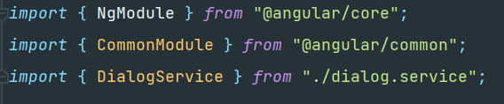
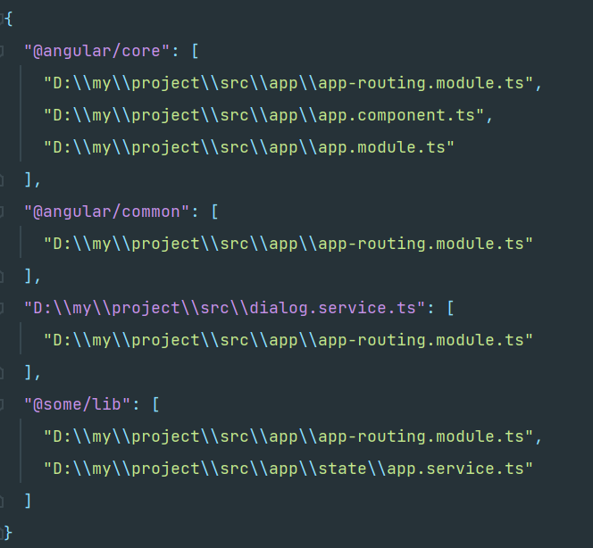

# ts-dependency-resolver
## What it is
The dependency resolver is used to analyze all the files of your Typescript project and returns a JSON with all their import dependencies

### What you see

### What you get

## Why do you need this?
There are several reasons why you could need such a tool.

1. You want to know what file is being used where
2. You only want to (re)build parts of your project if they really changed
3. Use it in a pipeline for enhanced stats, comparisons and other tooling like graphs! 

## How to use
1. Start the `DependencieResolver.exe` with an argument. The argument has to be a folder in your project. It can also be the root folder
2. The tool will generate a `dependencies.json` in the folder you provided.
3. ???
4. Profit

## Disclaimer
The tool currently only works with some variants of imports.
